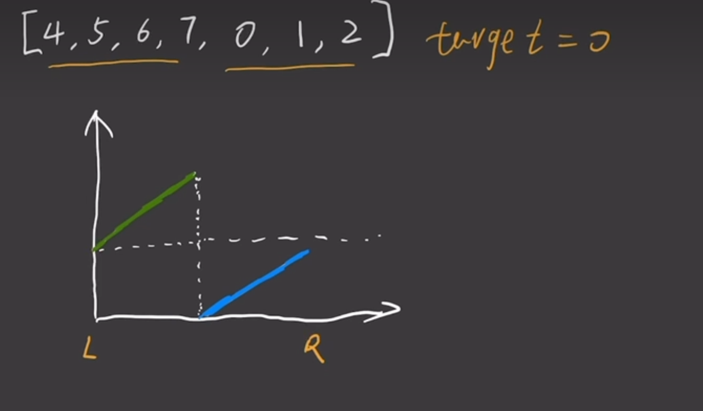

# 33. 搜索旋转排序数组

\[4,5,6,&#x37;*,&#x20;*&#x20;    0,1,2]

将数组一分为二，其中一定有一个是有序的，另一个可能是有序，也能是部分有序。 此时有序部分用二分法查找。无序部分再一分为二，其中一个一定有序，另一个可能有序，可能无序。就这样循环. 



## 判断条件可以由该图得出

```java
package leetcode.editor.cn.mycode.ID33;

import java.util.Arrays;

public class 搜索旋转排序数组 {
    class Solution {
        public int search(int[] nums, int target) {
            int n = nums.length;
            int l=0,r=n-1;
            while (l<=r)
            {     
                int mid=(l+r)/2;
                if(nums[mid]==target){
                    return mid;
                }
                //如果左边为有序
                if(nums[l]<=nums[mid])
                {
                    //利用左边有序判断是否在左边
                    if(nums[l]<=target&&nums[mid]>target)
                    {
                       r=mid-1;
                    }
                    else  l=mid+1;
                }
                else //右边有序
                {
                    //利用左边有序判断是否在左边
                    if (nums[mid] < target && nums[r] >= target) {
                        l = mid + 1;
                    } else r = mid - 1;
                }
            }
            return -1;
        }

    }

}

```
